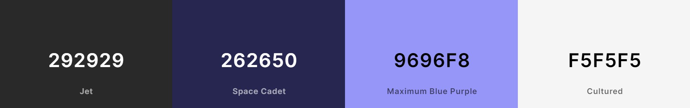

<h1 align=center > Cleverpy </h1> 

 ## :clipboard: Indice 

- [Sobre el proyecto](#sobre-el-proyecto)

    - [Tecnologías utilizadas](#wrench-tecnologías-utilizadas)

    - [Origen](#mag-origen)

    - [Paleta de colores](#art-paleta-de-colores)

- [Scripts](#space_invader-scripts)

# Sobre el proyecto

Para visitar el proyecto te puedes dirigir directamente a su [deploy](https://mike-cleverpy.vercel.app/)

## :wrench: Tecnologías utilizadas

```TypeScript
const stack:technologie[] = [
    "React",
    "TypeScript",
    "Redux",
    "Cypress",
    "Sass",
    "FramerMotion",
    "Prettier",
    "EsLint",
    "Vite"
]
```

## :mag: Origen


Consiste en una prueba técnica solicitada por [Cleverpy](https://cleverpy.com/), el objetivo principal es diseñar, implementar y conectar un plataforma con “cards”, en concreto, los resultados
ofrecidos por [esta llamada GET](https://jsonplaceholder.typicode.com/posts).

Para este caso no es necesario disponer de un backend, aunque yo he querido implementar uno muy simple usando el localstorage, este guarda los datos de usuarios y posts creados desde un navegador.

Los requisitos principales a cumplir son:

- Código totalmente en TypeScript.

- Tipado sin tipos any.

- Código en React.

- Uso de componentes funcionales.

- Buena identación.

- No usar librerías externas que realicen la función descrita en el documento.

## :art: Paleta de colores




Para los colores de la aplicación he usado unos colores sobrios, para no saturar y generar un efecto "Rainbow". También se ha incluido en diversos lugares el degradado de [Cleverpy](https://cleverpy.com/), para darle identidad.

# :space_invader: Scripts
    
## `npm run dev`
    
Inicializa un servidor de prueba.
    
## `npm run dev:net`
    
Inicializa un servidor de prueba con acceso desde otros dispositivos (ideal para probar el responsive). 
    
## `npm run format`

Aplica Prettier a todos los archivos para que compartan la misma estética.

## `npm run cypress:open`

Ejecuta Cypress para realizar el test e2e.

<h1 align=center > Autor </h1>

<h1 align=center > :rocket: <a href='https://github.com/MrSetOne'>Michael Lara Sánchez</a> :rocket: </h1>